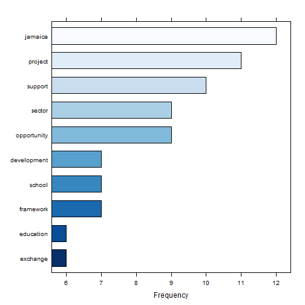
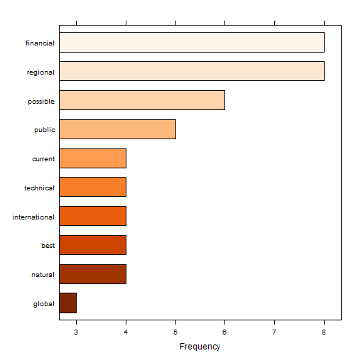
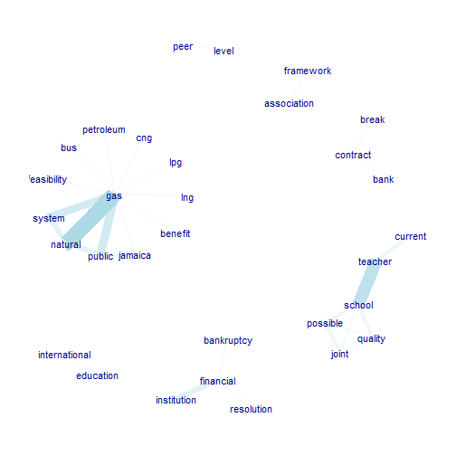
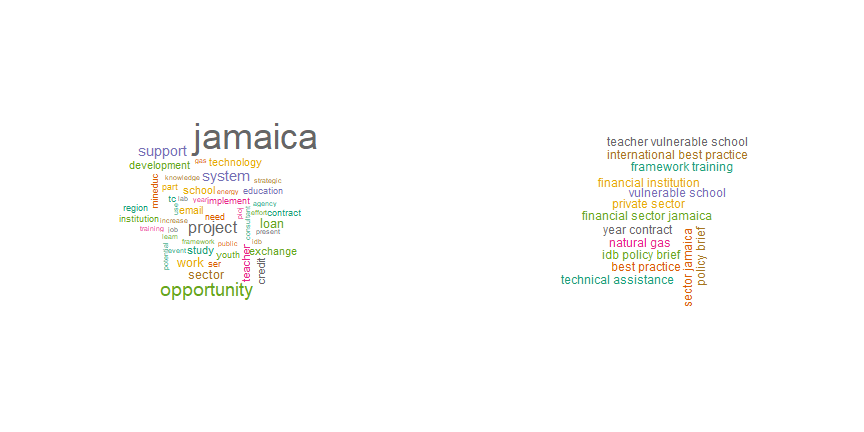
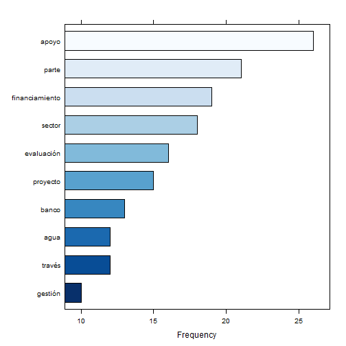
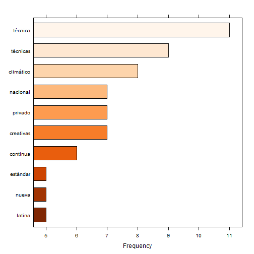
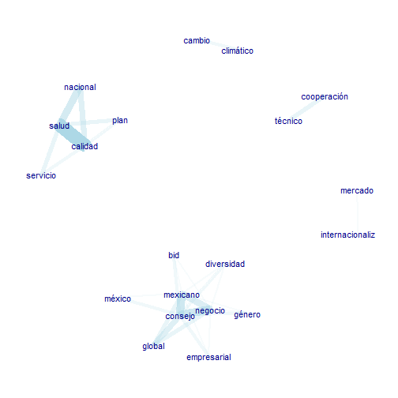
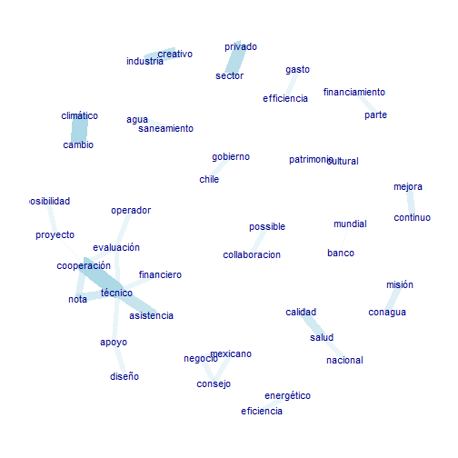
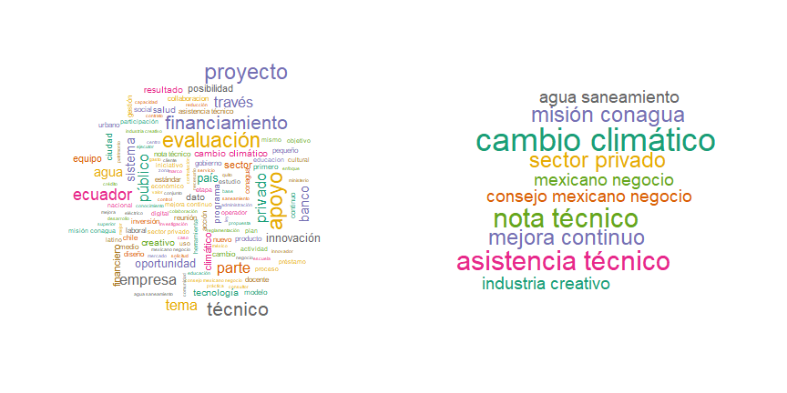

<!--
{r, results="hide"} - The chunks is run but all results are hidden. The code shows in the doc, however.
{r, include=FALSE} - the code is run but neither the code or the results are shown
{r, echo=FALSE} - The code is not shown, but results are
If you want a code chunk to run and not produce console output but you DO want to see the resulting graphs, you can sink() to /dev/null` like the following:

sink("/dev/null")
Desc(mtcars)
sink(); 
--> 

## Text mining analysis: Procedure and Overview

I.  Load Libraries and data sets.

II. Filter out all records with missing description.


III. View frequencies of languages in description field.

      
      ```
      ## 
      ##        catalan         danish        english         french        frisian 
      ##              6              1             80              4              1 
      ##          latin middle_frisian         nepali      rumantsch        spanish 
      ##              1              1              1              2            121
      ```
IV. Create separate data sets for descriptions in english and spanish. Prepare description Field for Text Mining Analysis:
lowercase, remove stopwords.

      

&nbsp;

V. [Download Description in languages other than english, spanish or french.](./OppDesc.xlsx)


---


## Previous results of Descriptive Analysis

&nbsp;

1. 75% of Opportunities have been generated by Ecuador, Jamaica, Mexico and Uruguay.
&nbsp;
2. IDB has initiated 50%. 25% has NA initiator.
&nbsp;
3. 26% of Opportunities are in Education Sector, 20% are NA. The 3rd postion is shared by multisector, Financial Markets and Water and Sanitation, each with 10% of Opportunities.
&nbsp;
4. 29% of Opportunities are Closed (10% Lost and 9% won). 
&nbsp;
 
 [Download Descriptive Analysis.](./Opportunity.xlsx)

---  
  
## English POS Tagging
  
&nbsp;

**Use of pre-trained open- sourced models provided by UDpipe Community:**
  
  https://cran.r-project.org/web/packages/udpipe/vignettes/udpipe-annotation.html

&nbsp;

**UPOS (Universal Parts of Speech) frequency of occurrence:**
  
  &nbsp;


```
##    key freq freq_pct
## 1 NOUN  780 50.32258
## 2 VERB  227 14.64516
## 3  ADJ  194 12.51613
```

---

<!-- ## English POS Tagging  bar chart -->

<!-- ```{r, POSTaggingBar, echo=FALSE} -->
<!-- stats$key <- factor(stats$key, levels = rev(stats$key)) -->
<!-- barchart(key ~ freq, data = stats, col = "yellow", -->
<!--          main = "UPOS (Universal Parts of Speech)\n frequency of occurrence", -->
<!--          xlab = "Freq") -->
<!-- ``` -->

<!-- --- .class #id -->

## English POS: Nouns

Most Occurring Nouns in Descriptions



---

## English POS: Adjectives

### Most Occurring Adjectives in Descriptions

  

---


## English POS: Verbs

### Most Occurring Verbs in Descriptions

 

--- 

## RAKE: Rapid Automatic Keyword Extraction algorithm

&nbsp;

* Unsupervised algorithm that scores key phrases in a body of text by analyzing the frequency of each word appearance and its co-occurrence with other words in the text.

&nbsp;

* It looks for a contiguous sequence of relevant words searching for keywords.

&nbsp;

* For each word of any candidate keyword,it calculates a score which is the ratio of the word degree (how many times it co-occurs with other words) to the word frequency.

&nbsp;

* A RAKE score for the full candidate keyword is calculated by summing up the scores of each of the words which define the candidate keyword

--- 

### **English keywords Using RAKE**


--- 


### **English top noun - verbs pairs as keyword pairs**

<!-- ## Using a sequence of POS tags (noun phrases / verb phrases) -->
<!-- # This function allows to extract phrases, like simple noun phrases, complex noun phrases or any -->
<!-- # exact sequence of parts of speech tag patterns. -->
<!-- # An example use case of this is to get all text where an adjective is followed by a noun or for example -->
<!-- # to get all phrases consisting of a preposition which is followed by a noun which is next followed by -->
<!-- # a verb. -->
<!-- # extract phrases. These are defined as a sequence of Parts of Speech Tags. -->
<!-- # Common type of phrases are noun phrases or verb phrases. -->
<!-- # How does this work? Parts of Speech tags are recoded to one of the following one-letters: -->
<!-- #   (A: adjective, C: coordinating conjuction, D: determiner, M: modifier of verb, N: noun or proper noun, P: preposition). -->
<!-- # Next you can define a regular expression to indicate a sequence of parts of speech tags which you want to extract from the text. -->

<!-- ## Simple noun phrases (a adjective+noun, pre/postposition, optional determiner and another adjective+noun) -->


--- 


### **Co-occurrences: Frequency of words -nouns & adjectives - in the same sentence**



--- 

### **Co-occurrences: Frequency of words -nouns & adjectives - following one another**


--- 

### **Co-occurrences: Frequency of words -nouns & adjectives - following one another skipping up to 2 words in between**


--- 


## English Textrank (word network ordered by Google Pagerank)

### Unigram and ngrams with frequency over 2
<!-- Textrank is an algorithm implemented in the textrank R package. The algorithm allows to summarise text and as well allows to extract keywords. This is done by constructing a word network by looking if words are following one another. On top of that network the 'Google Pagerank' algorithm is applied to extract relevant words after which relevant words which are following one another are combined to get keywords. -->




---  
  
## Spanish POS Tagging
  
&nbsp;

**Use of pre-trained open- sourced models provided by UDpipe Community:**
  
  https://cran.r-project.org/web/packages/udpipe/vignettes/udpipe-annotation.html

&nbsp;

**UPOS (Universal Parts of Speech) frequency of occurrence:**
  
  &nbsp;


```
##    key freq freq_pct
## 1 NOUN 1420 37.24102
## 2  ADJ  743 19.48597
## 3 VERB  586 15.36848
```

--- 


## Spanish POS: Nouns

Most Occurring Nouns in Descriptions



--- 

## Spanish POS: Adjectives

### Most Occurring Adjectives in Descriptions



--- 


## Spanish POS: Verbs

### Most Occurring Verbs in Descriptions


--- 


### **Spanish keywords Using RAKE**


--- 


### **Spanish top noun - verbs pairs as keyword pairs**


  

--- 


### **Co-occurrences: Frequency of words -nouns & adjectives - in the same sentence**



--- 

### **Co-occurrences: Frequency of words -nouns & adjectives - following one another**


---

### **Co-occurrences: Frequency of words -nouns & adjectives - following one another skipping up to 2 words in between**



---


## Spanish Textrank (word network ordered by Google Pagerank)

### Unigram and ngrams with frequency over 2
<!-- Textrank is an algorithm implemented in the textrank R package. The algorithm allows to summarise text and as well allows to extract keywords. This is done by constructing a word network by looking if words are following one another. On top of that network the 'Google Pagerank' algorithm is applied to extract relevant words after which relevant words which are following one another are combined to get keywords. -->
  
  

---


